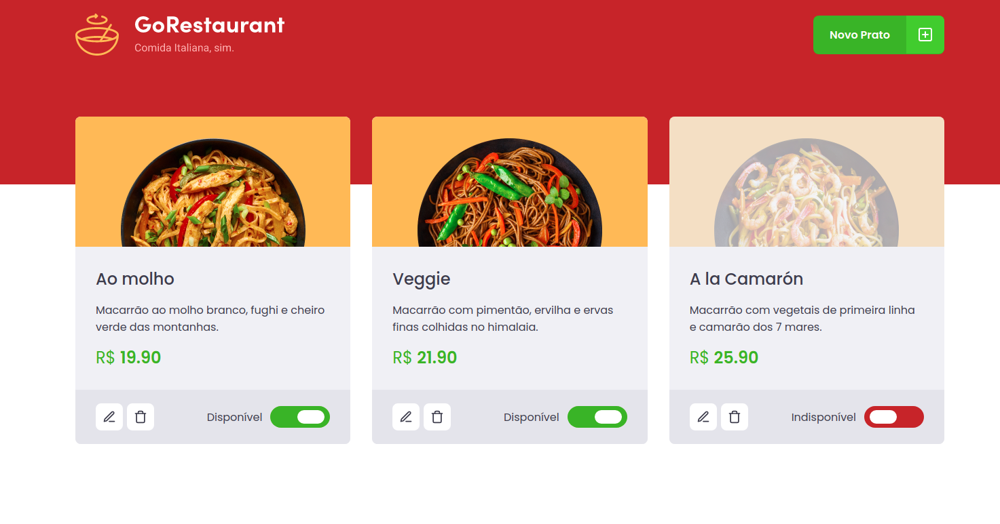
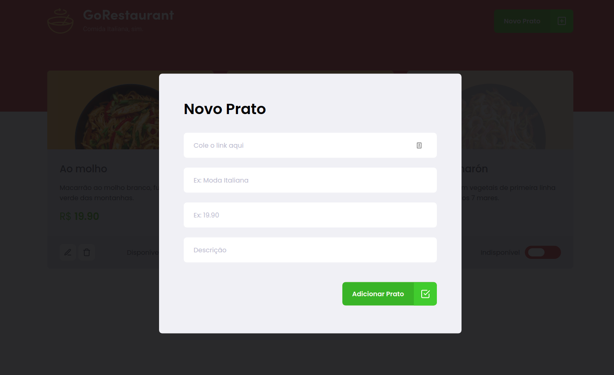

# GoRestaurant's Web Page

ReactJS project proposal as a challenge by the instructor during the Rocketseat GoStack course to memorize the content.

This is the GoRestaurant's Web Page to manage the food orders.

## What I learned in this project?

 - Create a modal using react-modal library
 - Transform a checkbox input in a slider component

## See the screenshots

